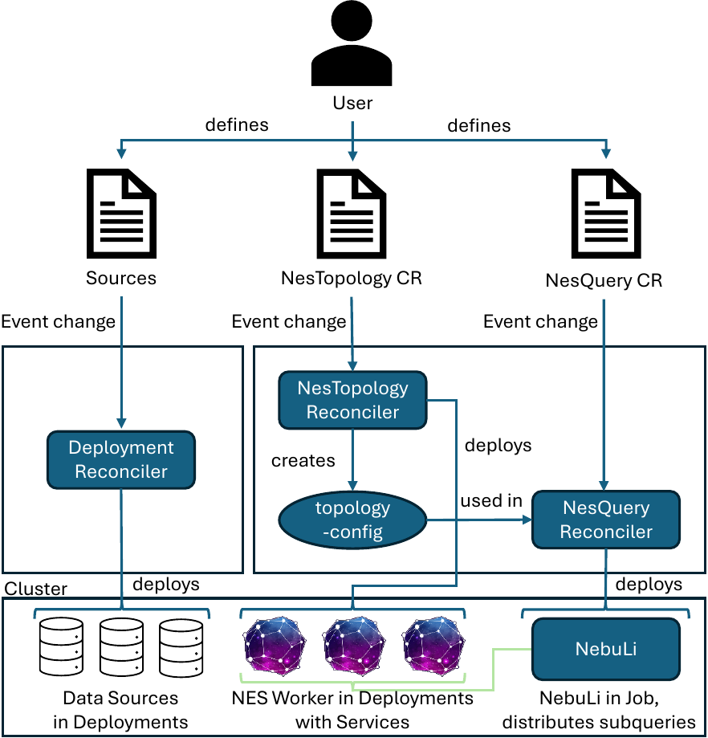
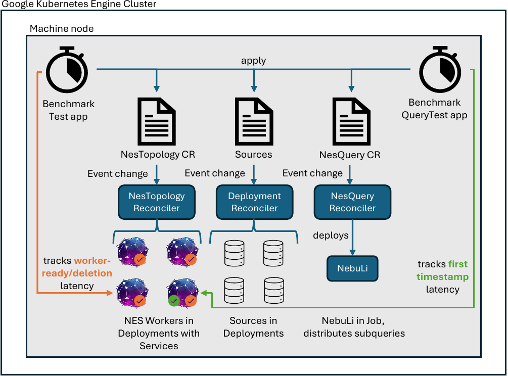

# NebulaStream Kubernetes Operator
This project is a first draft of a Kubernetes Operator for deploying the NebulaStream topology on Kubernetes clusters. 
Implemented during the Bachelor's thesis of Cihat-Sidar Cicek. Implements the following features:
- Deploy NES workers (as NesTopology) on Kubernetes clusters
- Deploy NebuLi (as NesQuery) on Kubernetes clusters, which is used to launch queries

## Setup
To run the operator and benchmarks, we need to set up a Google Kubernetes Engine (GKE) cluster. Machine type 
n2-standard-16 with location europe-west3-a is sufficient for running the operator and benchmarks. In addition, helm
and kubectl need to be installed on the local machine.

## Usage
To deploy the operator, run the following command:
```shell

helm install helm-setup-operator ./helm-setup-operator
```
To run topology benchmarks (includes deployment of operator), run the following command:
```shell

helm install helm-setup-topobench ./helm-setup-topobench
```
To run query benchmarks (includes deployment of operator), run the following command:
```shell

helm install helm-setup-querybench ./helm-setup-querybench
```

To delete the helm setup (replace name accordingly), run the following command:
```shell

helm uninstall helm-setup-querybench
```

To delete remaining resources (as helm is not deleting the resources created by the operator), run the following command:
```shell

make delete-all
```

## Custom Resource Definitions
### NesTopology CRD
Contains NES worker, physical sources, logical sources and sinks. 

### NesQuery CRD
Contains NebuLi.

## Sources
In the current implementation, sources have to be deployed seperately and are not managed by the operator.
The description of sources in the NesTopology CRD serve current only as NebuLi input.

## Architecture

### Solution Overview



### Benchmark Overview




## References
The project skeleton is generated from https://javaoperatorsdk.io/docs/getting-started/bootstrap-and-samples/.

